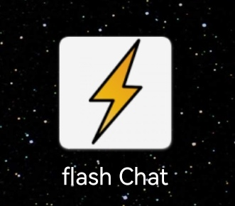
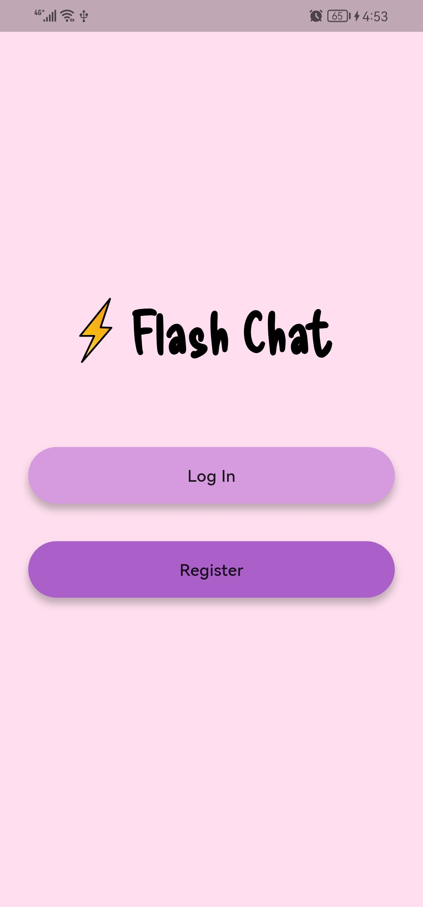
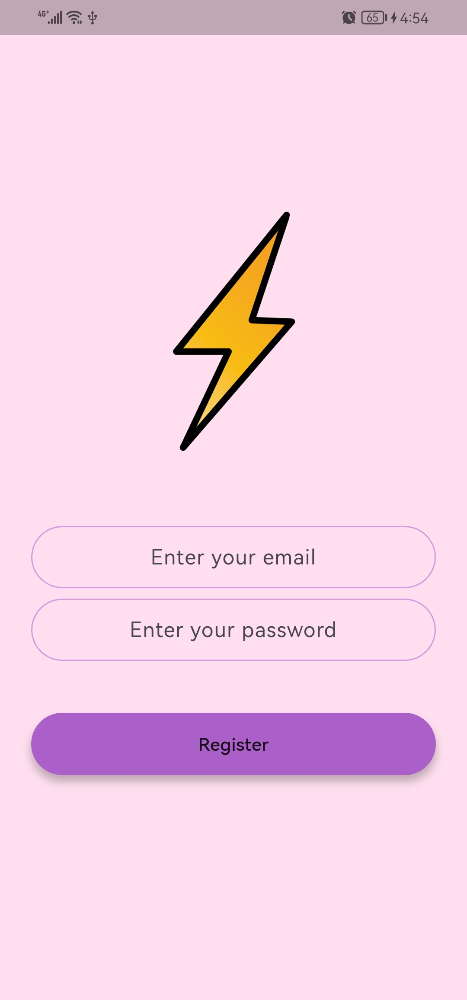
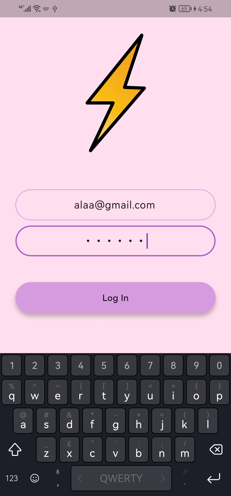
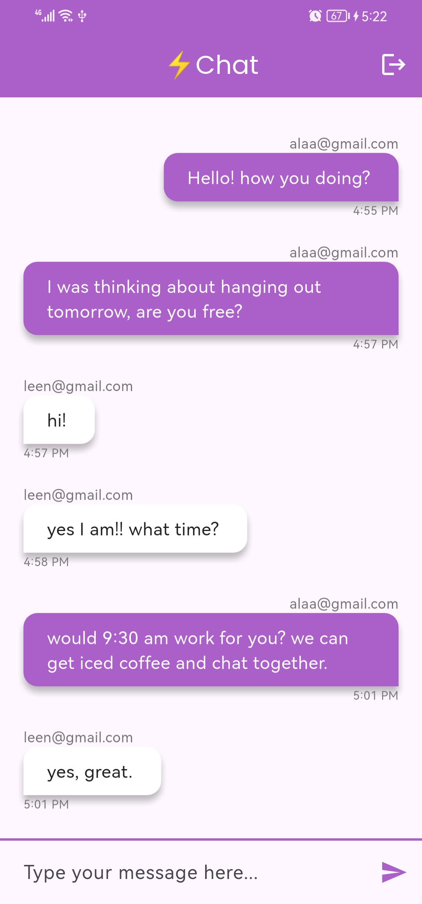
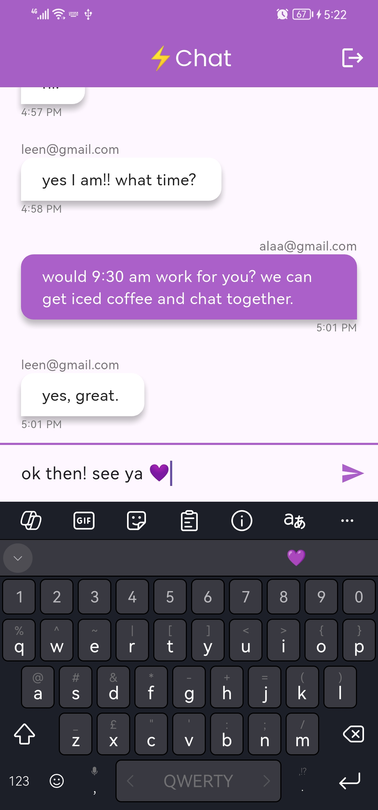

# ⚡️ Flash Chat App

## ✨ Overview

a modern real-time chat application built with Flutter and powered by Google's Firebase!

## 🚀 Features

User Authentication: Securely register and log in users using email and password.

Real-time Messaging: Send and receive messages instantly in a live chat environment.

Intuitive UI: A clean and easy-to-use interface for seamless communication.

Responsive Design: Designed to work across various screen sizes (mobile).

Splash/Landing Screen: Handles initial user authentication status check, directing users to the chat or welcome screen accordingly.

## 📸 Screenshots

## 🚀 Technologies Used
- Flutter
- Dart
- Firebase Authentication
- Cloud Firestore
